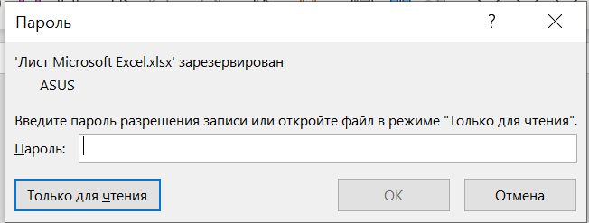
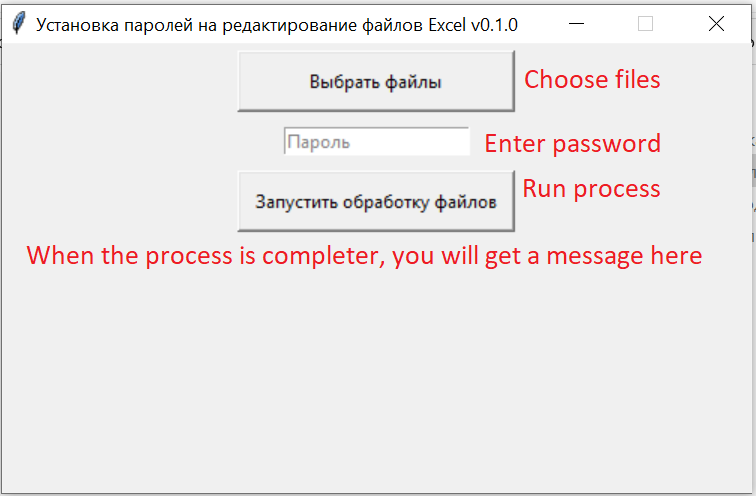

# Excel Locker
> This is a little app that sets passwords to your excel files.

It takes a bunch of your excel files and applies a macro script to each of them. 
The macro opens each file sets password and resaves the file.

That is what you get as a result.

## Installation

OS X & Linux:

DOESN'T WORK ON LINUX, DUE TO CSCRIPT.EXE
SUPPOSE, THE SAME THING WITH OS X

Windows:

To open the app on Windows either run gui.py via console or execute Exele Loker X.X.X.exe

## Usage example

## Additional info

This is a first version of the app. I needed it for work, so I spent very little time on it. However, as I need to use it on a daily basis, I plan to work on its development.

If you find this app usefull for your business, feel free to take, use and work on it.

NOTE: I'm a novice to python dev, so don't blame me for mistakes or some bad practices. I would really appriciate any reasonable comments =)

## TODO
Here are my thoughts of what would be nice to add or fix:

* Set up an error handler that can catch and display errors that occure in VBA. For now the app show the success message, even if the password is not set, for example, due to too long filename or if an already locked file wasn't unlocked by user while executing the task.

*  Design for sure.

* Add function and choice that would completely lock file (for this - change one string in VBA):

    ASIS workbook.SaveAs "{excel_file_path}",,, "{password}"
    TOBE workbook.SaveAs "{excel_file_path}",, "{password}" 

## Release History

* 1.1.2
    * Add error handler. Now, if there was an error in executin excel macro or somthing went wrong with excel, the program will print an error.
* 1.1.1
    * Fixed PEP-8 warnings
    * No more console popups while executing cscript.exe
* 1.1.0
    * When restarting the process whithout reopening file, old lables are deleted. 
* 1.0.0
    * The first wellworking version
    * Add a few "design" corrections
    * Fixed some code issues
* 0.1.0
    * The first proper release
* 0.0.1
    * Work in progress

## Meta

[https://github.com/agas0077](https://github.com/agas0077)

## Contributing

1. Fork it
2. Create your feature branch
3. Commit your changes
4. Push to the branch
5. Create a new Pull Request
